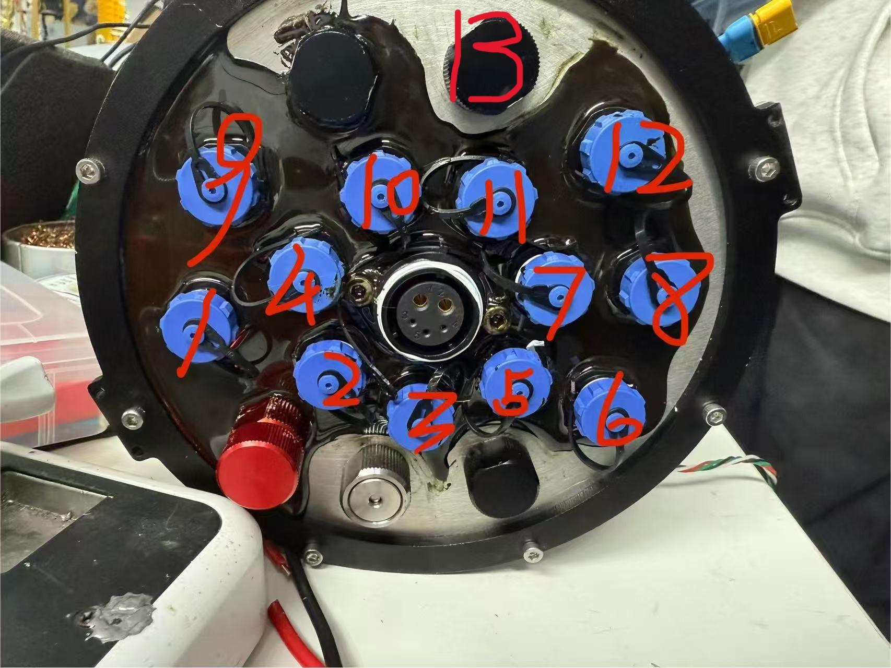

# 北冕座

### 开发人员：黄仕鹏、李嫣然、左杨、于亚博、黄迦南、薛松、王奕涵

### 使用说明
#### 电脑（上位机）连接
1.修改以太网地址为   
   192.168.66.*   
    [*取值除1,2]
2. 使用终端或（vscode)进行远程连接，指令为  
   ssh lyr@192.168.66.2  
   #ssh方式 用户名@树莓派ip地址  
   #遇到WARNING: REMOTE HOST IDENTIFICATION HAS CHANGED!  输入  
   ssh-keygen -R IP  
   清除远程主机的公钥（此处IP更改为树莓派 IP）
3. 连接成功后运行 AUVr2025.exe

### 尾部接线

序号
4 右前垂
1 右后垂
2 左前垂
3 左后垂
6 右后
5 右前
8 左前
7 左后
10 大臂
9 小臂
11 爪子
13 针筒抽拉
12 上爪箱

### 手柄控制

左摇杆 前后左右平移
右摇杆 左右转、上浮下沉
X B 爪子张合
Y A 小臂旋转
左右扳机 大臂上下
RB LB 爪箱张合
start 定深PID开关
十字键左右 针筒右抽左推
十字键上下 摄像头上下
左摇杆按下 水面保持
右摇杆按下 水底保持

### 摄像头网站
http://192.168.66.2:8080/?action=stream
http://192.168.66.2:8081/?action=stream