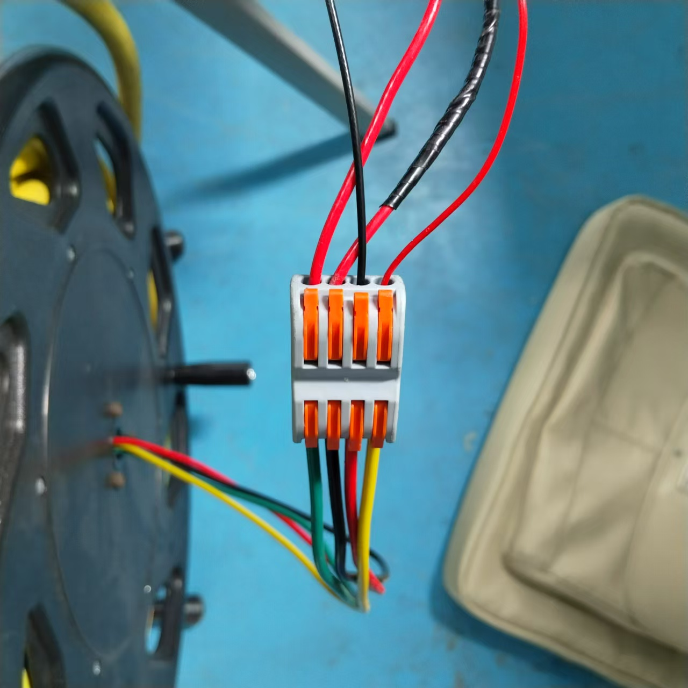
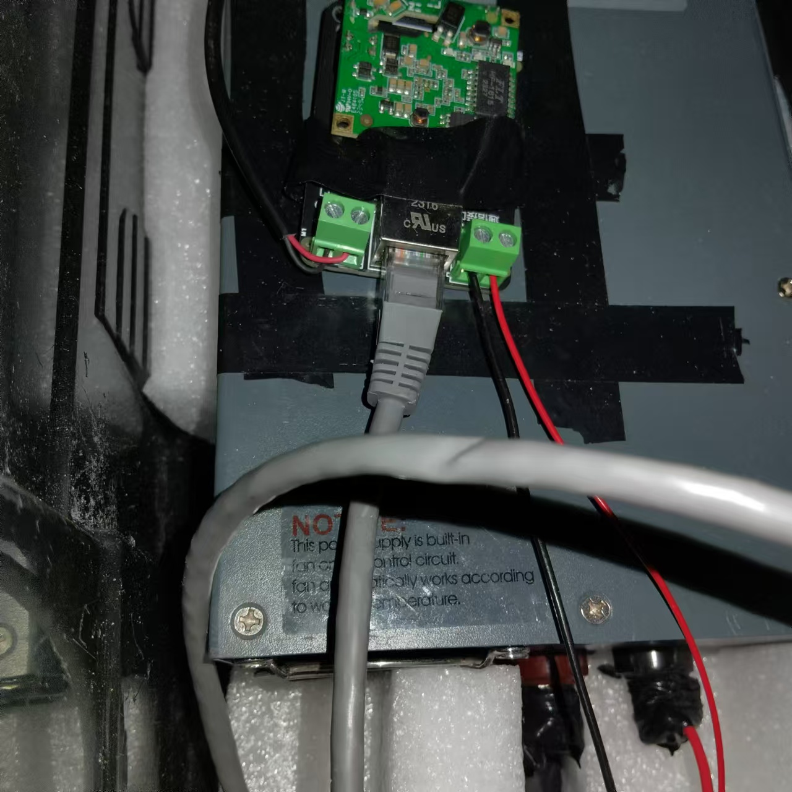
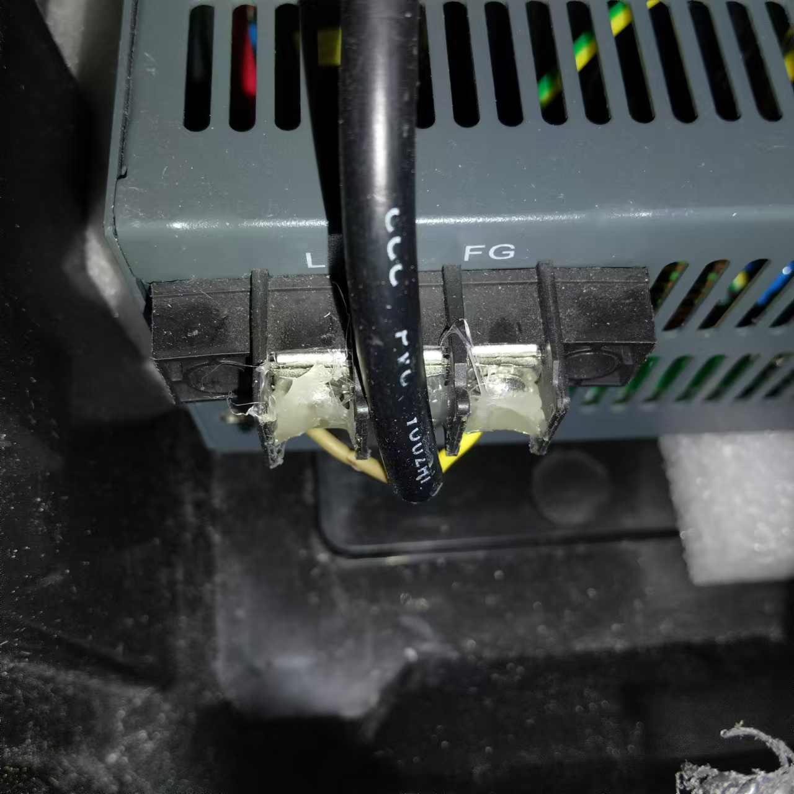
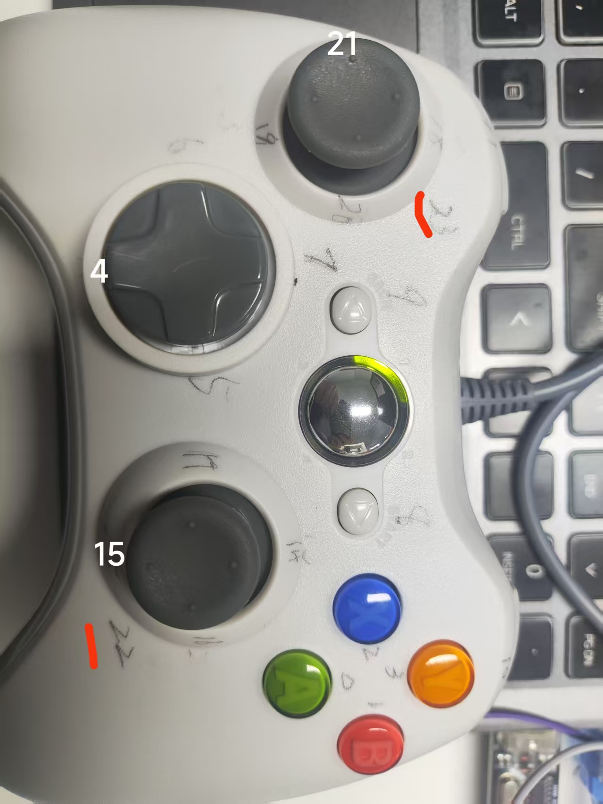

# 猎户座

### 开发人员：黄仕鹏、李嫣然、左杨、于亚博

### 使用指南
#### 电脑（上位机）连接
1. 修改以太网地址为   
   192.168.66.*   
    [*取值除1,2]
2. 使用终端或（vscode)进行远程连接，指令为  
   ssh lyr@192.168.66.2  
   #ssh方式 用户名@树莓派ip地址  
   #遇到WARNING: REMOTE HOST IDENTIFICATION HAS CHANGED!  输入  
   ssh-keygen -R IP  
   清除远程主机的公钥（此处IP更改为树莓派 IP）
3. 连接成功后运行 tx.exe

### 接线

### 手柄控制

字母键
Y 前进
A 后退
X 左平移
B 右平移

左摇杆
上下 大臂上下
左右 左右转

右摇杆
上下 小臂旋转
左右 摄像头云台上下

十字键
上下 上浮下沉
左右 暂无

back键 切换速度

RB和LB 机械爪张合

### 摄像头网站
http://192.168.66.2:8080/?action=stream